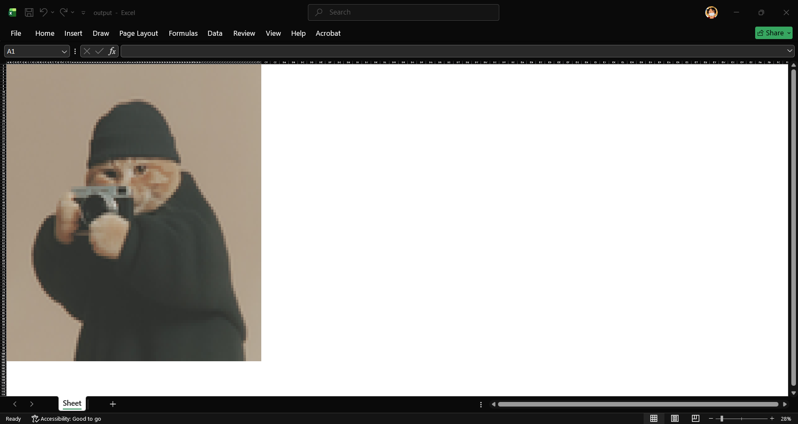

# 🖼️ Image to Excel Mosaic

Convert any image into a pixel art mosaic inside an Excel workbook — one colored cell per block.


---

## How It Works

```
Original Image  →  Crop to grid  →  Resize (LANCZOS)  →  Color Excel cells
```

The image is divided into blocks of N×N pixels. Each block's average RGB color fills one Excel cell. The result is a full-resolution mosaic viewable directly in Excel.

The core trick: instead of manually averaging 100 pixels per block, `Image.resize()` with LANCZOS resampling does exactly that — in a single line, at C speed.

---

## Demo

| Input Image | Excel Output |
|---|---|
|  |  |

---

## Requirements

```bash
pip install pillow openpyxl
```

---

## Usage

```python
from image_to_excel import image_to_excel

image_to_excel("photo.jpg")                          # default block size 10
image_to_excel("photo.jpg", "mosaic.xlsx", 5)        # smaller blocks = more detail
image_to_excel("photo.jpg", "mosaic.xlsx", 20)       # larger blocks = more abstract
```

### Parameters

| Parameter | Type | Default | Description |
|---|---|---|---|
| `image_path` | str | required | Path to input image (JPEG, PNG, etc.) |
| `output_path` | str | `output.xlsx` | Path for the output Excel file |
| `block_size` | int | `10` | Size of each pixel block in pixels |

### Tips

- Zoom out to **10–20%** in Excel to see the full mosaic
- Smaller `block_size` → more detail, more cells, slower to render
- Keep the output grid under **200×200 cells** for smooth Excel performance

---

## Project Structure

```
image-to-excel/
│
├── image_to_excel.py   # Main script
├── README.md
└── examples/           # Sample input images and outputs (optional)
```

---

## Possible Improvements

- [ ] Variable block size via CLI argument
- [ ] Support for PNG transparency (RGBA)
- [ ] Progress bar with `tqdm`
- [ ] GUI with drag & drop (Tkinter)
- [ ] Color quantization (limit palette to N colors)
- [ ] ASCII Art mode (map brightness to characters)

---

## License

MIT — free to use, modify, and distribute.
